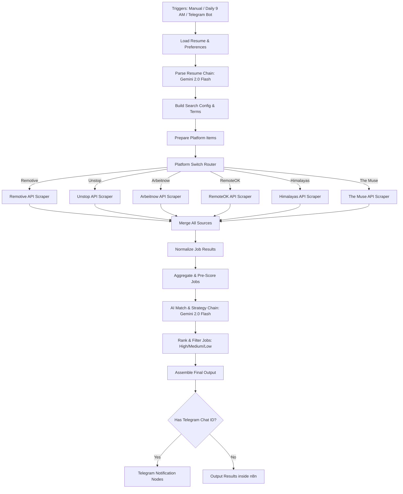

# O-Clario: Autonomous AI-Powered Job Hunter (100% Free n8n Agent)

<div align="center">
  
  
  
  
</div>

---

**O-Clario** is a production-grade, autonomous, AI-driven job hunt agent built entirely on **n8n**. It runs **100% free of charge** by combining free public job board endpoints with the generous free tier of **Google Gemini 2.0 Flash**. 

O-Clario concurrently scrapes multiple major remote job boards, uses Gemini AI to parse your resume, matches and scores opportunities from 0-100 against your profile, drafts personalized cover letter pitch angles, highlights missing skills, and delivers a highly polished daily strategy card straight to your Telegram chat.

---

## 🚀 Key Features

*   **⚡ Concurrence Engine Scraper**: Scrapes 6 premium remote job boards in parallel (Remotive, Unstop, Arbeitnow, RemoteOK, Himalayas, and The Muse) using keyless, open JSON endpoints.
*   **🧠 Deep AI Resume Parsing**: Uses Gemini 2.0 Flash to convert raw resume text into a highly structured JSON profile containing skills, education, experience, domains, and seniority levels.
*   **📊 Match & Score (0-100)**: Evaluates the top 30-40 aggregated job openings against your profile, assigning match scores, documenting strengths, listing missing skills, identifying red flags, and creating unique application pitch hooks.
*   **💡 Career Strategy Generator**: Generates an executive market positioning report, tactical preparation guides, salary insights, and target resume improvements.
*   **🤖 Interactive Telegram Client**: Runs manually, via interactive Telegram slash commands, or on a scheduled automated trigger (e.g. daily at 9:00 AM).
*   **💵 100% Free Stack**: Designed for zero-cost operation. No paid scraping proxies, RapidAPI keys, or database hostings are required.

---

## 📐 System Architecture & Data Flow



---

## 🛠️ Step-by-Step Installation

### Prerequisites
1.  A working **n8n** instance (Local Desktop, Docker container, Cloud hosting, or self-hosted).
2.  A free **Google Gemini API Key** (Get it from [Google AI Studio](https://aistudio.google.com/)).
3.  A **Telegram Bot Token** and your **Chat ID** (Follow the instructions below to create one).

---

### Step 1: Create a Telegram Bot
1.  Open Telegram and search for the **@BotFather** user.
2.  Send `/newbot` and follow the prompts to name your bot and choose a username.
3.  **BotFather** will send you a HTTP API Token (e.g. `123456789:ABCdefGhIJKlmNoPQRsTUVwxyZ`). Copy this.
4.  Start your bot by searching its username on Telegram and clicking **Start** (or send `/start`).
5.  Get your personal **Chat ID** by starting a chat with **@userinfobot** or **@raw_data_bot** and copying the ID number (e.g., `5513468743`).

---

### Step 2: Import the Workflow
1.  Download or copy the contents of the [workflow.json](workflow.json) file in this repository.
2.  Open your **n8n dashboard**.
3.  Click **Add workflow** (or click the top-right menu and choose **Import from file**).
4.  Alternatively, click anywhere on the blank canvas and press `Ctrl+V` (or `Cmd+V` on macOS). n8n will render the entire workflow pipeline.

---

### Step 3: Link Credentials in n8n

#### 1. Google Gemini API
*   Find either of the circular model nodes: **Gemini Parse Resume** or **Gemini Match & Strategy**.
*   Double-click it.
*   In the **Credential to connect with** dropdown, select **Create New Credential**.
*   Name it `Google Gemini API` (or keep the default ID `ADD_GEMINI_CREDENTIAL`).
*   Paste your **Gemini API Key** into the API Key field and save it.

#### 2. Telegram Bot API
*   Find the **Telegram Job Results** or **Telegram Trigger** node.
*   Double-click it.
*   In the **Credential to connect with** dropdown, select **Create New Credential**.
*   Name it `Telegram Bot API` (or keep the default ID `ADD_TELEGRAM_CREDENTIAL`).
*   Paste your **Telegram Bot Token** into the Access Token field and save it.

---

### Step 4: Configure Your Resume & Preferences
1.  Double-click the **Load Resume & Preferences** node (the green Code node near the start).
2.  Inside the code editor, update the `resumeText` variable with your actual resume content.
3.  Update the `userPreferences` object to customize your search parameters:
    ```javascript
    const userPreferences = {
      locations: ['Remote', 'Gurgaon', 'Bengaluru', 'Hyderabad', 'Delhi NCR'],
      jobType: ['Full-time', 'Internship'],
      platforms: ['remotive', 'unstop', 'arbeitnow', 'remoteok', 'himalayas', 'themuse'],
      maxJobsForGemini: 30 // Maximum parsed jobs to send to Gemini (helps manage rate limits)
    };
    ```
4.  Under the Chat ID fallback configuration, make sure your Telegram Chat ID is configured (the workflow is currently pre-configured with `5513468743` as the fallback):
    ```javascript
    const fallbackChatId = "5513468743"; // Replace this with your Chat ID
    ```
5.  Click **Close** to save.

---

### Step 5: Execute & Activate
*   **Run Manually**: Click **Execute Workflow** at the bottom of the canvas. The scraping, AI processing, and formatting will run in the background. In a few moments, you will receive a beautiful markdown dashboard directly in your Telegram chat.
*   **Activate Scheduler**: Toggle the **Active** switch in the top-right corner to allow the workflow to run automatically on the scheduled triggers (such as the daily 9:00 AM check).

---

## 📈 Supported Job Boards (100% Free & Keyless APIs)

O-Clario leverages the following keyless JSON feeds, completely bypassing rate-limited scrapers or paid key services:

| Platform | Job Exporter API Endpoint | Category / Focus | Key Required? |
| :--- | :--- | :--- | :--- |
| **Remotive** | `https://remotive.com/api/remote-jobs` | General Remote (Tech, Design, Marketing) | **No** (100% Free) |
| **Unstop** | `https://unstop.com/api/public/opportunity/search-result` | Freshers, Interns, tech events, & Indian Markets | **No** (100% Free) |
| **Arbeitnow** | `https://www.arbeitnow.com/api/job-board-api` | European & General Developer roles | **No** (100% Free) |
| **RemoteOK** | `https://remoteok.com/api` | Global Remote Developer & Creator jobs | **No** (100% Free) |
| **Himalayas** | `https://himalayas.app/jobs/api` | High-quality tech & Web3 Remote jobs | **No** (100% Free) |
| **The Muse**| `https://www.themuse.com/api/public/jobs` | General Tech, Corporate, & Entry-level | **No** (100% Free) |

---

## ⚙️ Production Guidelines & Optimizations

*   **API Rate Limits**: Google Gemini's free tier has a limit of 15 Requests Per Minute (RPM). To safeguard against rate-limiting on high-yield scraping runs, O-Clario features a built-in pre-scoring filter that ranks scraped jobs using keywords and only passes the top `maxJobsForGemini` matches (default: `30`) to the LLM for deep matching.
*   **Dynamic Scraping**: If you want to search only a subset of job boards, simply modify the `platforms` list inside the **Load Resume & Preferences** node. The dynamic switch router will automatically bypass deactivated platforms without blocking the rest of the workflow.
*   **Hosting cost**: You can host this n8n instance on free application hosting tiers (like Render, Koyeb, or Hugging Face Spaces) or run it locally on your PC.

---

## 📄 License

This project is licensed under the MIT License. Feel free to copy, modify, and distribute it.
"# Job-Automation" 
